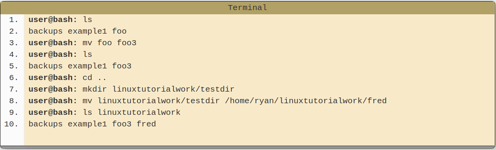

# The Command Line
[Home](../Readme.md)

### The command line, or terminal is a text based interface to the system that allows us to enter commands by typing them on the keyboard. Opening a terminal varies depending on the operating system, but is fairly easy. 
 - If you're on a Mac then you'll find the program Terminal under Applications -> Utilities. 
 - If on Linux then you will probably find it in Applications -> System or Applications -> Utilities.Alternatively you may be able to 'right-click' on the desktop and there may be an option 'Open in terminal'.

 There's vast array of commands within the terminal but some of the most commons are as follows:

 - `pwd` - **Stands for Print Working Directory** - It tells us what the current or present working directory is.
- `ls` - **Short for list** - Prints the contents of specific directory. 

There are two types of paths available for use; **absolute** and **relative**. Absolute paths specify a location (file or directory) in realtion to the root directory. They are easily identified by the `/` at the beginning. Relative paths specify a location (file or directory) in relation to the current location in the system. These do no begin with a slash.

- `~` (tilde) - This is a shortcut for your home directory. eg, if your home directory is `/home/drae` then you could refer to the directory Documents with the path `/home/drae/Documents` or `~/Documents`
- `.` (dot) - This is a reference to your current directory. eg in the example above we referred to Documents on line 4 with a relative path. It could also be written as `./Documents` .
- `..` (dotdot)- This is a reference to the parent directory. You can use this several times in a path to keep going up the hierarchy. eg if you were in the path `/home/drae you could run the command ls ../../` and this would do a listing of the root directory.

- `cd` - **Stands for Change Directory** - If ran without arguments this will take us back to the home directory. The location is specified as a path and may be specified as either an absolute or relative path and using any of the path building blocks already mentioned.

Other systems like Windows are case insensitive, when it comes to referring to files. Linux makes it possible to have multiple files of the same name with different cases.

**Note about hidden files** - Using the command line option `-a` lets us view hidden files within a target directory.

- `mkdir` - Short for Make Directory - Supplying a directory name will create just that.
**Interesting Note** - including `-p` tells `mkdir` to make parent directories as needed and adding `-v` lets us see what `mkdir` is doing.

- `rmdir` - Remove Directory - This command supports `-p` and `-v` just like `mkdir`. **CANNOT UNDO**

- `touch` - Creates a blank file of the specified filetype.

- `cp` - Copy - Using the `-r` option, which stands for recursive, let us copy directories.

- `mv` - Move - Normally `mv` would be used to move a file or directory in a new directory. However it can also be used to rename a given file or directory.

- `rm` - Remove - Lets us delete a file. Using the -r option lets us remove all files within the directory. **CANNOT UNDO**