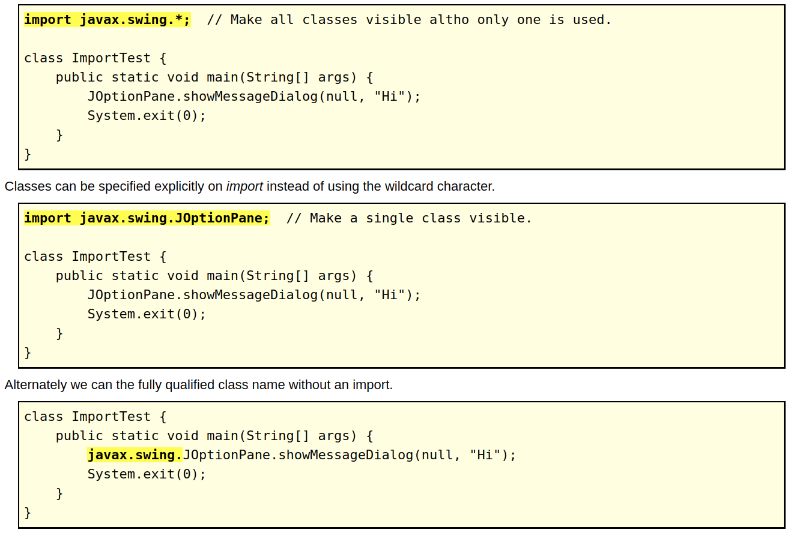

# Packages and Import
[Home](../Readme.md)

Java classes can be grouped together in packages. A package name is the same as the directory (folder) name which contains the .java files. We declare packages when we define our Java program, and name the packages we want to use from other libraries in an `import` statement.

## Package declaration

The first statement (optional), other than comments, in a Java source file hsa to be the package declaration.Import statements allow us to specirfy classes from other packages that can be referenced without qualifying them with their package.

### Statement Order:
- 1. Package statement (optional)
- 2. Imports (optional)
- 3. Class or interface definitions (optional)

### Import Options

The `JOptionPane` class is in the `swing` package, which is located in the `javax` package. The `wildcard` character (*) is used to specify that all classes with that package are available to your program. This is the most common programming style.

There are 166 packages containing 3279 classes and interfaces in Java 5. However, only a few packages are used in most programming. GUI programs typically use at least the first three imports.

`import` `java.awt.*;`	        Common GUI elements.
`import` `java.awt.event.*;`	The most common GUI event listeners.
`import` `javax.swing.*;	`   More common GUI elements. Note "javax".
`import` `java.util.*;`	        Data structures (Collections), time, Scanner, etc classes.
`import` `java.io.*;`	        Input-output classes.
`import` `java.text.*; `    	Some formatting classes.
`import` `java.util.regex.*;`	Regular expression classes.

Source
[Packages and Import](https://perso.ensta-paris.fr/~diam/java/online/notes-java/language/10basics/import.html)