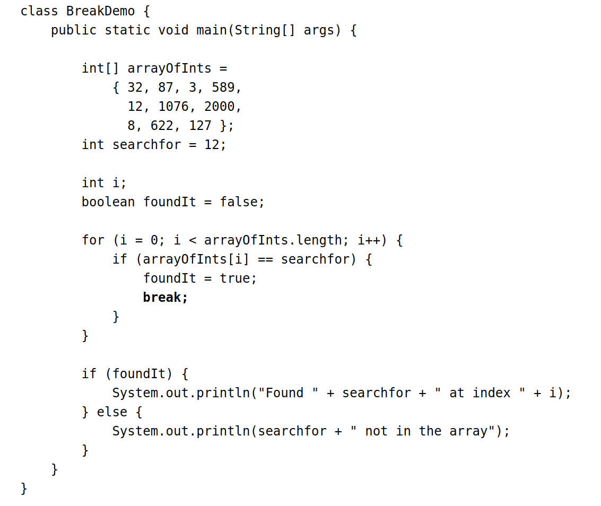
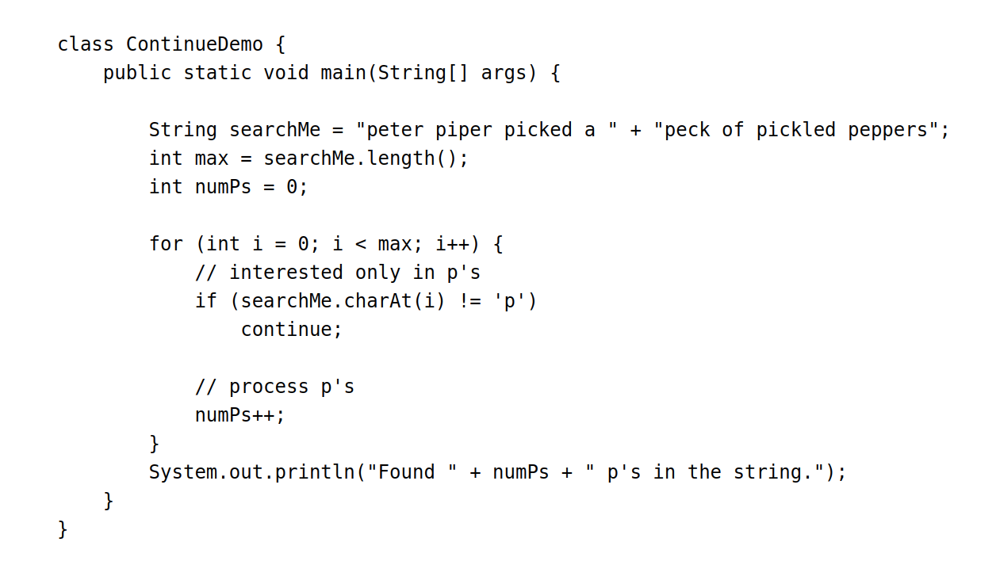

# Java Basics
## Branching Statements
[Home](../Readme.md)

###### Break
The `break` statement has two forms: **labeled** and **unlabeled**. Unlabeled breaks can be used to terminate a for, while, or do-while loop.

In the above example, the program searches the array for the number `12`. The `break` statement terminates the for loop when that value is found. Control flow then transfers to the statement after the for loop. An unlabeled break statement terminates the innermost `switch`, `for`, `while`, or `do-while` statement, but a labeled break terminates an outer statement.

###### Continue
The `continue` statement skips the current ieration of a for, while, or do-while loop. The unlabeled form skips to the end of the innermost loop's body and evaluates the boolean expression that controls the loop. 

This program steps through a `String`, counting the occurences of the letter `p`. If the current character is not a `p`, the continue statement skips the rest of the loop and proceeds to the next character. If it is a `p`, the program increments the letter count. 

###### Return
The return statement exits from the current method, and control flow retuns to where the method was invoked. This statement has two forms: *one that returns a value*, and *one that doesn't*. To return a value, simply put the value (or an expression that calculates the value) after the return keyword.

`return ++count;`

The data type of the returned value must match the type of the method's declared retun value. When a method is declared void, use the form of retun that doesn't return a value.

`return;`

## Sources
[Branching Statements](https://docs.oracle.com/javase/tutorial/java/nutsandbolts/branch.html)