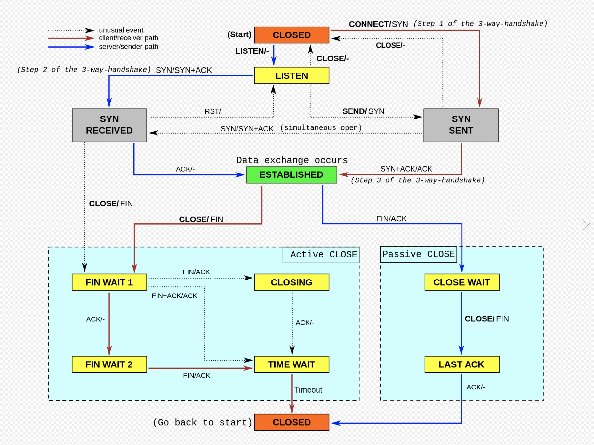

# Java Web Request & Response Cycle
[Home](../Readme.md)
## The HTTP Request Lifecycle

### Step 1: Local Processing
The browser extracts the "scheme"/protocol,and optional port number, resource path, and query 
strings that are specified in the form
### Step 2: Resolve an IP
Resolving an IP from "DNS server" is a sequence that includes many steps, and includes failovers 
if the first request fails to return an address. 
### Step 3: Establish a TCP Connection
Since the request is sent over TCP, which is a transport layer protocol like UDP, the client 
must open a TCP connection. 
### Step 4: Send an HTTP Request
Now that the client has an IP address and a TCP connection, it can send an HTTP request. Once 
the requests is received,the server,processes the resource being requested. It then generates an 
HTTP response and responds to the clients request. 
### Step 5: Tearing Down and Cleaning Up
Once the response has been fully delivered, the client sends a FIN packet at the TCP level, to 
which the server responds with an ACK and then generally sends a FIN of its own, which the client 
responds to with its own ACK signal. The client then waits for a brief timeout, during which it 
cannot accept new connections, to prevent delayed packets from previous connections arriving 
during subsequent activities on the port. This four way handshake signals the end of the TCP 
connection. At this point the browser begins processing what is received and rendering to the 
page.  

 