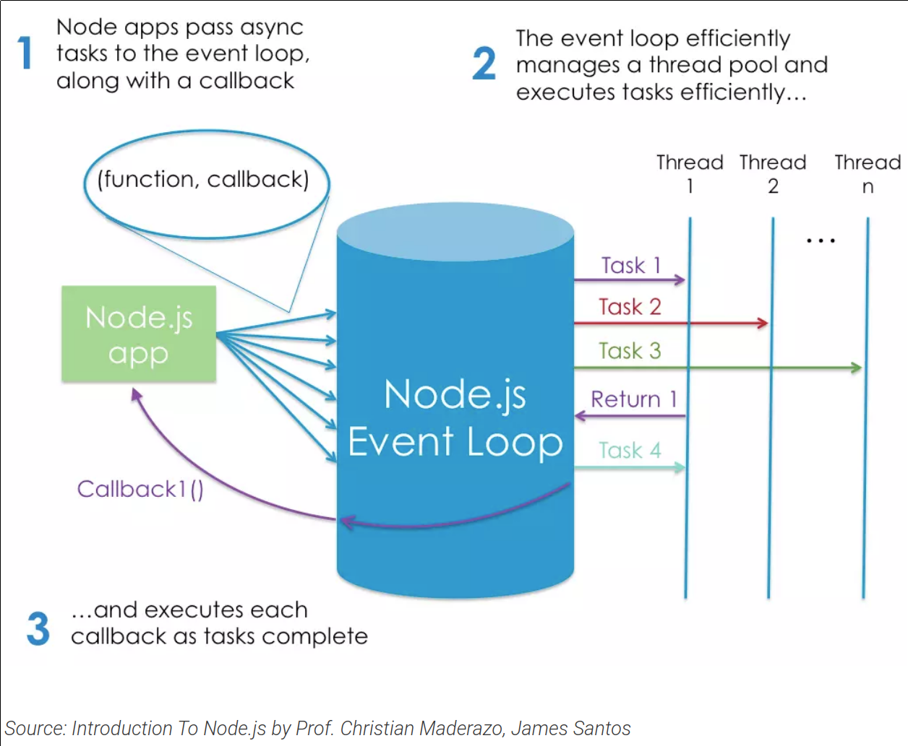

# Node.js

### Definition

There are plenty of definitions to be found online. Let’s take a look at a couple of the more popular ones. This is what the project’s home page has to say:

*Node.js is a JavaScript runtime built on Chrome’s V8 JavaScript engine.*

And this is what Stack Overflow has to offer:

*Node.js is an event-based, non-blocking, asynchronous I/O runtime that uses Google’s V8 JavaScript engine and libuv library.*

### Built on Google's V8 JavScript Engine

The V8 engine is the open-source JavaScript engine that runs in Google Chrome and other Chromium-based web browsers, including `Brave`, `Opera`, and `Vivalidi`. It was designed with performance in mind and is responsible for compiling JavaScript directly to native machine code that our computers can execute.

### Use Cases

Common uses cases for node include installing (via npm) and running (via Node) various build tools - designed to automate the process of developing a modern JavaScript application. The build tools come in all shapes and sizes, and you won't get far in a modern JavaScript landscape without bumping into them. 

Node.Js allows us to run JavaScript on the server. When you connect to a traditional server, such as Apache, it will spawn a new thread to handle the request. In a language such as `PHP` or `Ruby`, any subsequent I/o operations (for example, interacting with a database) block the execution of your code until the operation has completed. 

The server has to wait for the database lookup to complete before it can move on to procesing the result. If new requests come in while this is happening, the server will spawn new threads to deal with them. This is potentially inefficient, as a large number of threads can cause a system to become sluggish -and, in the worst case, for the site to go down. The most common way to support more connections is to add more servers.

Node.js, is single-threaded. It's also **event-driven**, which means that everything that happens in Node is in reaction to an event. For example, when a new request comes in (one kind of event) the server will start processing it. If it then encounters a blocking I/O operation, instead of waiting for this to complete, it will register a callback before continuing to process the next event. When the I/O operation has finished (another kind of event), the server will execute the callbak and continue working on the original request. Under the hood, Node uses the **libuv** library to implement this asynchronous (that is, non-blocking) behavior.Node's execution model allows the server to handle a large number of simultaneous connections. 

###### Source: 
[James Hibbard: What is Node and When Should I Use It](https://www.sitepoint.com/an-introduction-to-node-js/)