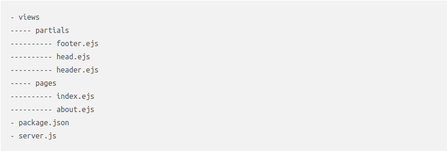
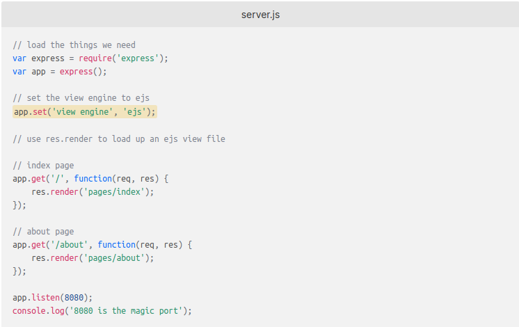

# EJS
[Home](../README.md)
#### Using EJS to Template Node Applications

EJS allows for a fast and easy way to template applications. Easy to set up EJS has proven to be a good alternative as opposed to Jade, the default view engine for Express.

Setting up a node application is simple. Below is the typical file and folder structure.

The only dependencies required are Express and EJS. After installing with `npm install` we need to set up and run our server.

To start up the server run `node server.js`. 

#### Source:
[Chris Sev](https://www.digitalocean.com/community/tutorials/how-to-use-ejs-to-template-your-node-application)
