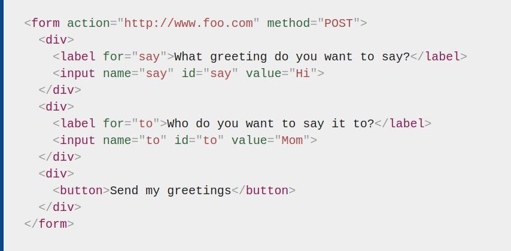

# Working with Forms
[Home](../README.md)

The web uses a client/server architecture essentially sends a request to a server using the HTTP protocol. The server answers the request using th same protocol.

An HTML form on a web page is a convenient user-friendly way to configure an HTTP request to send data to a server.This enables the user to provide information to be delivered in the HTTP request.

The `<form>` element defines how the data will be sent. All of its attributes are designed to let you configure the request to be sent when a user hits a submit button. The two most important attributes are `action` and `method`.

#### Action Attribute
The `action` attribute defines where the data gets sent. Its value must be a valid relative or absolute `URL`. If this attribute isn't provided, the data will be sent to the URL of the page containing the form - the current page.

In this example the data is sent to an absolute URL -`https://example.com`

Using a relative URL, the data is sent to a different URL on the same origin

Without specifying attributes, the `<form>` data will be sent to the same page the forms is present on.

#### Method Attribute

The method attribute defines how data is sent. The HTTP protocol provides several ways to perform a request; HTML form data can be transmitted via a number of different methods, the most common being the GET method and the POST method

Each time you want to reach a resource on the Web, the browser sends a request to a URL. An HTTP request consists of two parts: a **header** that contains a set of global metadata about the browser's capabilities, and a **body** that can contain information necessary for the server to process the specific request.

The **GET** method is the method used by the browser to ask the server to send back a given resource: *"Hey server, I want to get this resource."* In this case, the browser sends an empty body. Because the body is empty, if a form is sent using this method the data sent to the server is appended to the URL.

Since the `GET` method has been used, you'll see the URL `www.foo.com/?say=Hi&to=Mom` appear in the browser address bar when you submit the form.

The data is appended to the URL as a series of name/value pairs. After the URL web address has ended, we include a question mark `(?)` followed by the name/value pairs, each one separated by an ampersand `(&).` In this case we are passing two pieces of data to the server:

- `say`, which has a value of `Hi`
- `to`, which has a value of `Mom`

The `POST` method is what the browser uses to talk to the server when asking for a response that takes into account the data provided in the body of the HTTP request: *"Hey server, take a look at this data and send me back an appropriate result."* If a form is sent using this method, the data is appended to the body of the HTTP request.

This is the same form we looked at in the GET section above, but with the method attribute set to POST.

When the form is submitted using the POST method, you get no data appended to the URL, and the HTTP request looks like so, with the data included in the request body instead:

#### Source
[MDN: Sending Form Data](https://developer.mozilla.org/en-US/docs/Learn/Forms/Sending_and_retrieving_form_data)