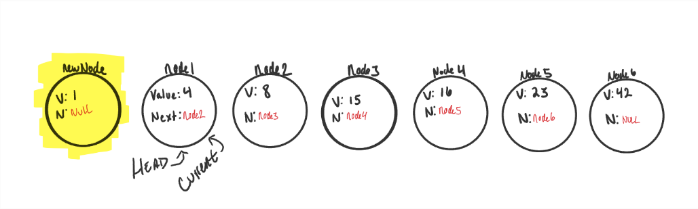
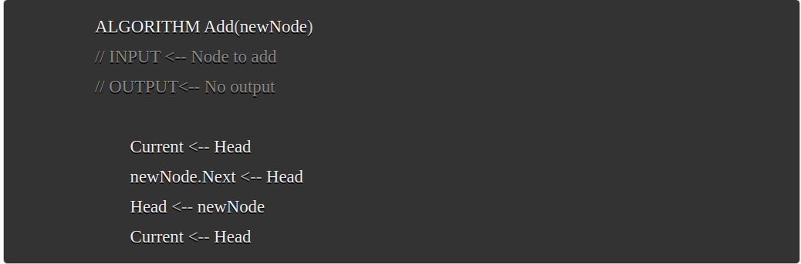

# Linked Lists
[Home](../Readme.md)
## Definitions
- **Linked List** - A data structure that contains nodes that links/points to the next node in the list
- **Singly** - There is only one reference, and the reference points to the next node in a linked list.
                                                  `1 -> 2 -> 3 -> 4`
- **Doubly** - Means that there is a reference to both the next and previous node
                                 ```1 <- 2 <- 3 <- 4 ```
                                 ```1 -> 2 -> 3 -> 4```
- **Node** - Individual items/links that live in a linked list. Each node contains the data for each link.
- **Next** - Contains the reference to the next node. (*Node at index 1 above .Next would be 3*)
- **Head** - A reference to the first node in a linked list
- **Current** - The reference type of the `node` that is currently being looked at.

Traversing a linked list can be accomplished by having the current node reference the next node as long as the next node is 
not null. This is typically done inside a while loop.

To add a node we have to replace the current `Head` of the linked list with the new node, without losing the reference
to the next node in the list.



Regardless of the number of Nodes, adding to the head will always be a O(1) time and space because it takes the same 
amount of time to add a new node to the beginning of the list, and no additional resources are being used.




## Sources
### [Terminology](https://codefellows.github.io/common_curriculum/data_structures_and_algorithms/Code_401/class-05/resources/singly_linked_list.html)