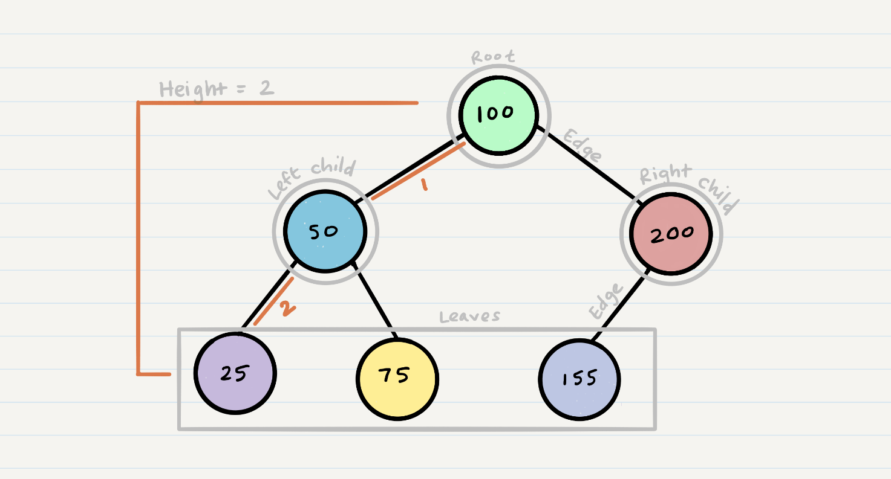
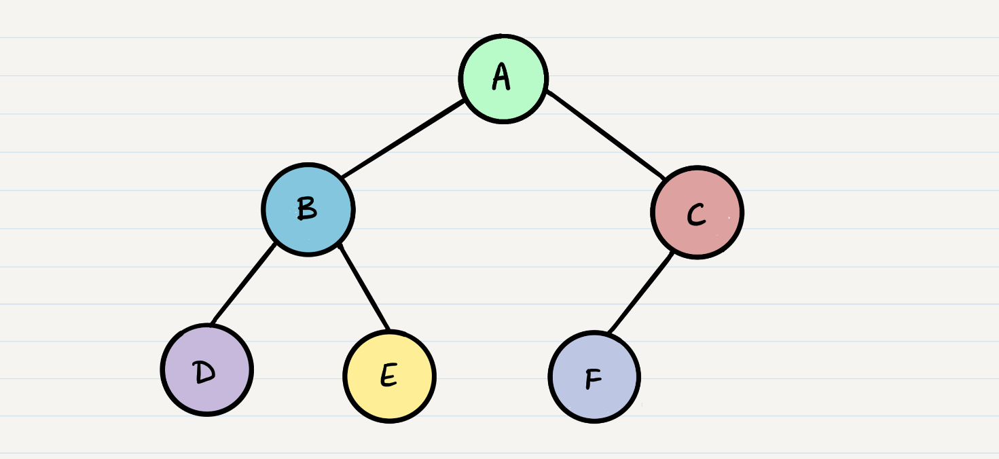
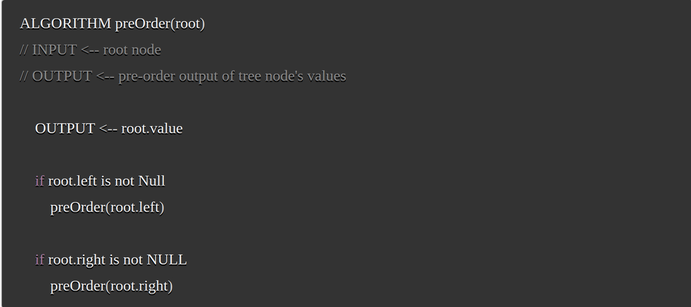
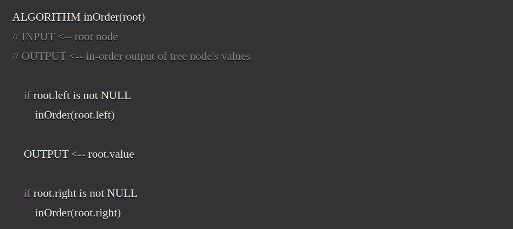
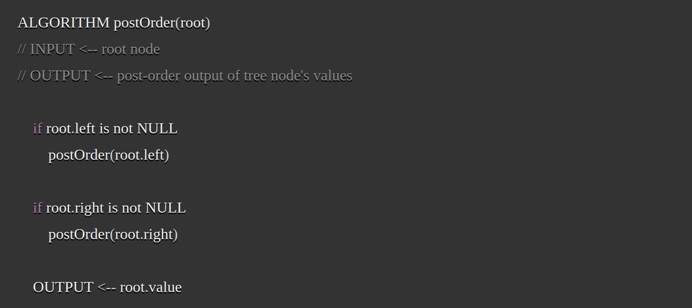
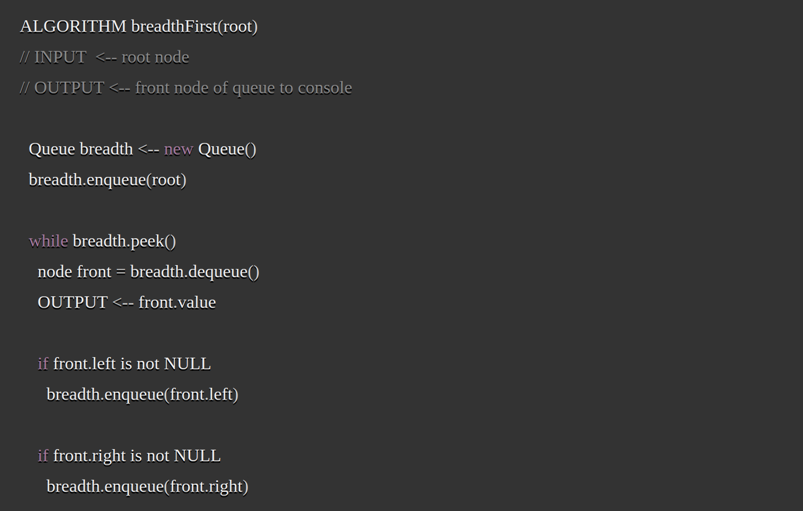

# Working with Trees
[Home](../Readme.md)

- `Node` - A Tree node is a component which may contain it’s own values, and references to other nodes
- `Root` - The root is the node at the beginning of the tree
- `K` - A number that specifies the maximum number of children any node may have in a k-ary tree. In a binary tree, k = 2.
- `Left` - A reference to one child node, in a binary tree
- `Right` - A reference to the other child node, in a binary tree
- `Edge` - The edge in a tree is the link between a parent and child node
- `Leaf` - A leaf is a node that does not have any children
- `Height` - The height of a tree is the number of edges from the root to the furthest leaf

There are two categories of traverals when it comes to trees:

- Depth First
- Breadth First

## Depth First 
Where wer prioritize going through the depth (height) of the tree first. There are multiple ways to carry out depth first traversal, and each method changes the other in which we search/print the root. 
Depth first methods

- `Pre-order`: `A, B, D, E, C, F`

- `In-order`: `D, B, E, A, F, C`

- `Post-order`: `D, E, B, F, C, A`

## Breadth first
Iterates through the tree by going through each level of the tree node-by-node. 

 #### Output: `A, B, C, D, E, F`

 

 ## Source
 [CodeFellow Resources](https://codefellows.github.io/common_curriculum/data_structures_and_algorithms/Code_401/class-15/resources/Trees.html)
